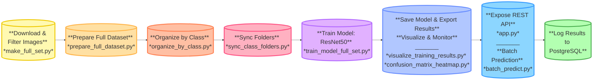

# DLBDSMTP01 – From Model to Production  

## Task 2: Image Classification for a Refund Department (Batch Processing)


## **1. Objective**

- This project builds an image classification system to automate the sorting of refund items based on product images.  
- A ResNet50 model is trained to predict product categories.  
- The system supports both batch predictions (scheduled daily) and real-time requests via a REST API.  
- Prediction results are stored in a PostgreSQL database.  
- The setup is containerized using Docker for reproducibility and deployment.

---

## **2. Setup and Installation**

### Clone the repository
```bash
git clone https://github.com/SkyFly03/DLBDSMTP01-From-Model-to-Production.git
cd DLBDSMTP01-From-Model-to-Production
```

### Create and activate a virtual environment
```bash
python -m venv venv
.\venv\Scripts\Activate.ps1
```

### Install dependencies
```bash
pip install -r requirements.txt
```

### Download dataset manually from Kaggle
- Source: https://www.kaggle.com/datasets/paramaggarwal/fashion-product-images-dataset  
- Place `styles.csv` in `data/full/`  

Final folder structure after processing:
```
data/full/train/     # Training images  
data/full/val/       # Validation images  
```

### Prepare dataset
- `make_full_set.py` — Filters and copies selected images  
- `prepare_full_dataset.py` — Splits data into train/val  
- `organize_by_class.py` — Sorts images by label  
- `sync_class_folders.py` — Ensures consistent category folders

### Start PostgreSQL and REST API
```bash
docker-compose up -d
```

### (Optional) Run test suite
```bash
python -m unittest tests/test_api_predict.py
```

---

## **3. Workflow Overview**



---

## **4. Model Training and Monitoring**

- `train_model_full_set.py` trains a ResNet50 classifier with learning rate scheduling and early stopping.  
- Accuracy and loss curves are logged and visualized.  
- The trained model (`refund_classifier_final.pt`) is excluded from the repository due to file size.  
- Full training logs and metrics are saved in:  
  `refund_classifier_training_log.pdf`

### Training Progress Output

The following terminal output shows real-time progress of training the ResNet50 model over 18 epochs:


### Training Accuracy and Loss Curve

Generated by `visualize_training_results.py`


---

## **5. Prediction Interfaces**

- `app.py` exposes a REST API (`/predict`) that supports both single and batch image prediction.
- `batch_predict.py` performs automated classification on new images in batch mode (e.g., nightly schedule).
- Results are logged in PostgreSQL including filename, predicted class, and timestamp.

---

## **6. Visualization**

- `visualize_training_results.py`: Plots training accuracy and loss curves
- `confusion_matrix_heatmap.py`: Creates a normalized confusion matrix for validation data

### Confusion Matrix (Validation)
Generated by `confusion_matrix_heatmap.py`


Visualizations are also stored in `model_images/` and included in the PDF log.

---

## **7. Containerization and Testing**

- `docker-compose.yml`: Runs the API and database in containers  
- `Dockerfile`: Builds the REST API service  
- `.env`: Used for environment variables (excluded from GitHub)  
- `tests/test_api_predict.py`: Unit test to validate the prediction endpoint

---

## **8. Documentation**

- All training metrics, performance graphs, and implementation notes are available in:  
  `refund_classifier_training_log.pdf`
- All Python scripts include header docstrings describing their function and usage.

---

## **9. Project Structure**

```
DLBDSMTP01-From-Model-to-Production/
├── app/
│   ├── __init__.py
│   ├── model.py
│   ├── predict.py
│   └── utils.py
├── data/
│   └── full/
│       ├── train/
│       ├── val/
│       └── styles.csv
├── model_images/
│   ├── confusion_matrix_validation_normalized.png
│   ├── training_curve_final_model.png
│   └── training_progress_api_accuracy.png
├── tests/
│   └── test_api_predict.py
├── .gitignore
├── Dockerfile
├── docker-compose.yml
├── README.md
├── app.py
├── batch_predict.py
├── check_data.py
├── clean_class_folders.py
├── confusion_matrix_heatmap.py
├── make_full_set.py
├── organize_by_class.py
├── prepare_full_dataset.py
├── refund_classifier_training_log.pdf
├── requirements.txt
├── sync_class_folders.py
├── train_model_full_set.py
└── visualize_training_results.py
```

---

## **10. Notes**

- Make sure to manually download and place the dataset in the correct folder paths before running any scripts.  
- Adjust paths in scripts if needed for your environment.  
- All components are included to reproduce the pipeline, excluding the dataset and final model weights.  
- Visuals and performance reports can be found in the attached PDF log.
